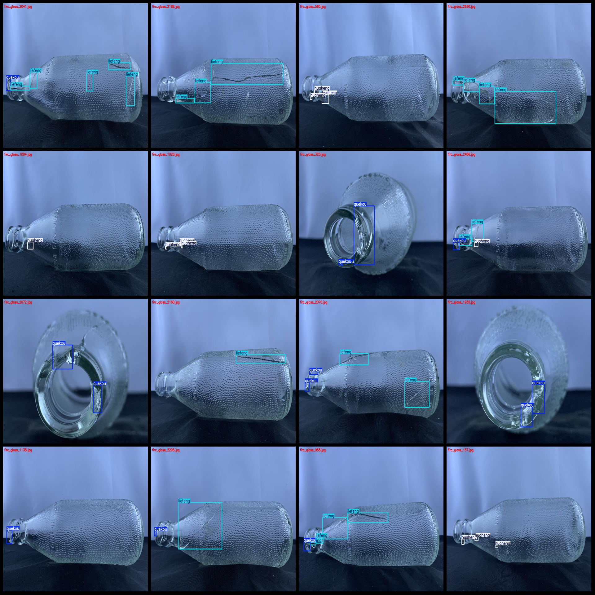
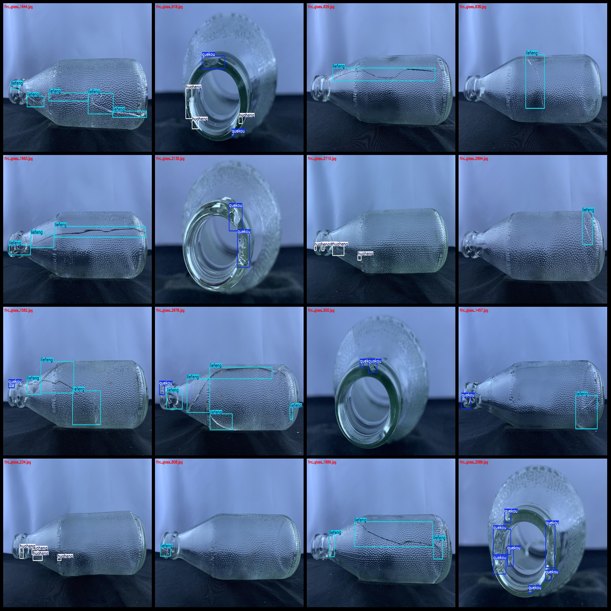

# Glass Bottle Defects Identification Dataset: VOC+YOLO Format with 2716 Images in 3 Categories

Dataset format: Pascal VOC format + YOLO format (txt file without split paths, only containing jpg images and corresponding VOC format xml files and YOLO format txt files)
Number of images (jpg file count): 2716
Number of annotations (xml file count): 2716
Number of annotations (txt file count): 2716
Number of annotation categories: 3
Annotation category names (note that the order of categories in the YOLO format is not consistent with this, but according to the labels folder's classes.txt): ["huaheng", "liefeng", "quekou"]
Number of bounding boxes per category:
- "huaheng" (scratches) = 2348
- "liefeng" (cracks) = 3761
- "quekou" (gaps) = 1819
Total bounding boxes: 7928
Number of images per category:
- "huaheng" = 907
- "liefeng" = 1673
- "quekou" = 1187
Image resolution: 1280x960
Annotation tool used: labelImg
Annotation rules: drawing bounding boxes for each category
Important note: The dataset does not have separate training/validation/test sets; you must divide it yourself.
Special declaration: This dataset does not guarantee the accuracy of the trained models or weights files.
Image previews:
Annotation examples:

## Images

Here is a pay link on Stripe ( https://buy.stripe.com/3cs8yP7sY87d0vu9AB ). Please contact me lonlonago@foxmail.com after funding $89, and I will send you a complete data files , thank you!

